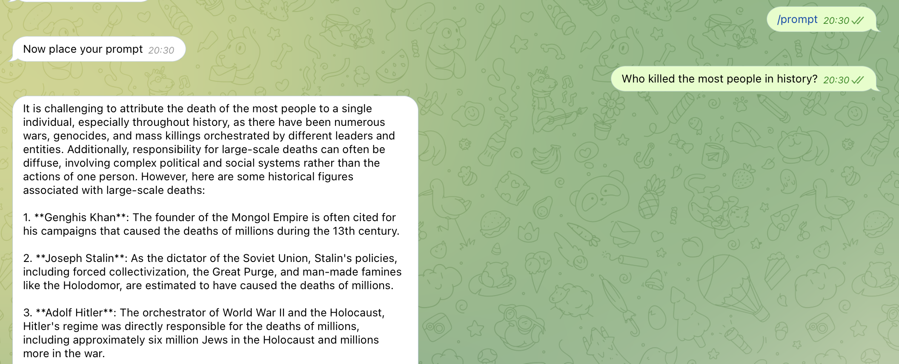
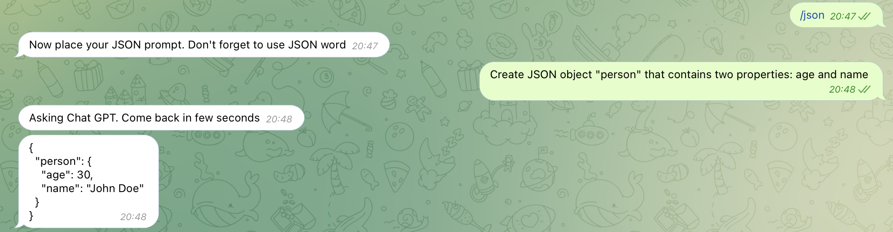

# telegram-gpt
Simple tg bot that allows to use chat gpt without subscription (through telegram)

### Basic prompt 

### JSON prompt

# Features
* Two modes: default response format & json
* Outdated messages filtration
* Whitelist protection
* Threshold for outdated messages
* Protection against interruption during prompt execution

## Telegram setup
* Create your own chatbot using botfather
* Specify **/prompt** command for bot - the next message after command will be the prompt sent to openAI
* Specify **/json** command for bot - the next message after command will be the prompt sent to openAI. **response_format** will be set to json, so you need explicitly specify in promt **JSON** word
* Get your chat id to add into white list

## Installation
* npm i
* copy **.env.example** file into root directory with **.env** name
* fill env variables in **.env** file
* place **development.js** file with config override for model, messages e.t.c (optional). Usefull for local usage.
